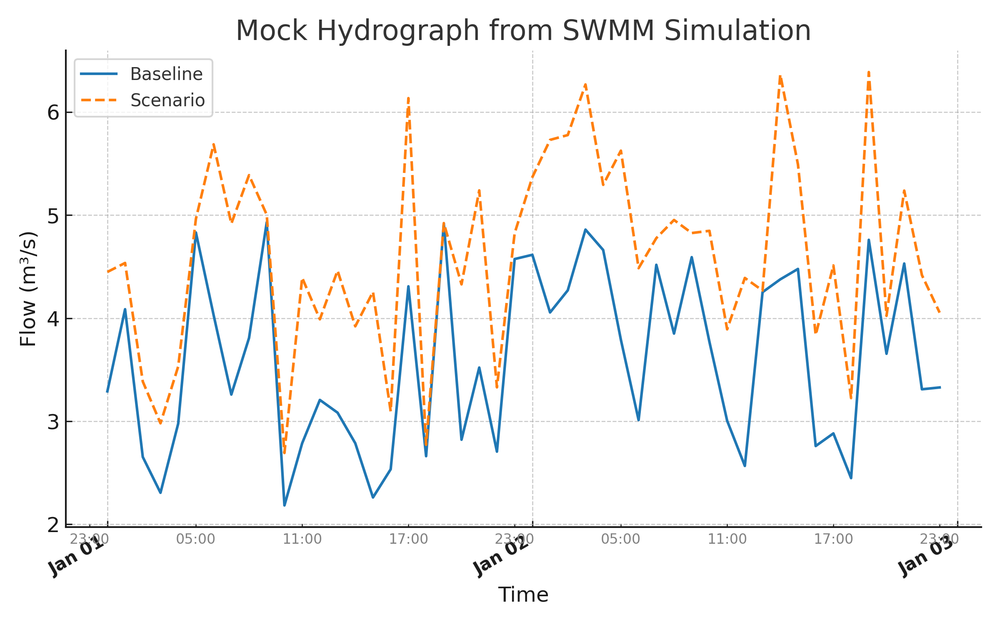

# GRASS GIS + Google Earth Engine → SWMM Pipeline

**Author:** Muhammad Amin Khan  
**Purpose:** Minimal working example showing how to integrate **GRASS GIS**, **Google Earth Engine**, and **SWMM** for stormwater modeling.

This workflow:
1. Fetches and preprocesses remote sensing & land cover data using Google Earth Engine.
2. Uses GRASS GIS for spatial analysis and watershed delineation.
3. Prepares and runs a simplified SWMM model to estimate peak flows.
4. Outputs hydrographs and summary statistics.

---

## Tools & Libraries
- Python 3.x
- GRASS GIS
- Google Earth Engine API
- EPA SWMM
- Pandas, NumPy, Matplotlib

---

## Example Output Hydrograph

The following hydrograph compares baseline and scenario flows from the mock SWMM simulation.  
Major ticks represent **days**, and minor ticks (in gray) represent **6-hour intervals** for better readability.

